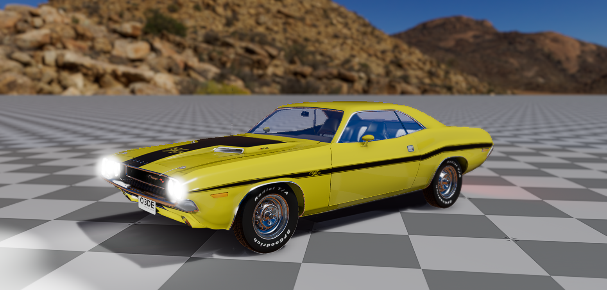
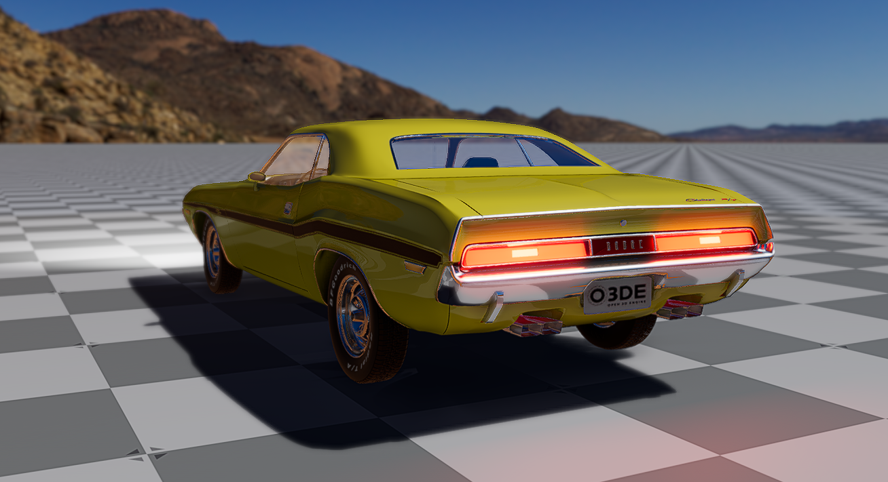

# O3DE Sample Vehicle Assets

by Paweł Budziszewski

## Overview

This repository contains a gem with a sample vehicle asset for [O3DE engine](https://o3de.org/) with the [Vehicle Dynamics Gem](https://github.com/RobotecAI/o3de-vehicle-dynamics-gem) created by RobotecAI.
At the moment it contains one model: a Dodge Challenger 1970 R/T. 

## Requirements

These assets were tested using:
- Vehicle Dynamics Gem ver. 1.0.0
- O3DE ver. 23.20.3, 24.9.0 (stabilization)
- Windows 11, Ubuntu Linux 22.04

This gem should work with newer versions of Vehicle Dynamics Gem (unless they introduce breaking changes).

## Usage

To use it just clone the repository, add the gem to your project and add `Assets/Vehicles/Dodge_Challenger_1970_rt/Dodge_Challenger_1970_RT.prefab` to the scene. You can also use [this sample project](https://github.com/pawelbudziszewski/O3DEDodgeChallenger1970RT).

## Notes

The model of the car is licensed under CC0 and was obtained from [Blend Swap](https://www.blendswap.com/blend/4046) (available on Sept 12, 2024). It required some modifications to be used in O3DE.